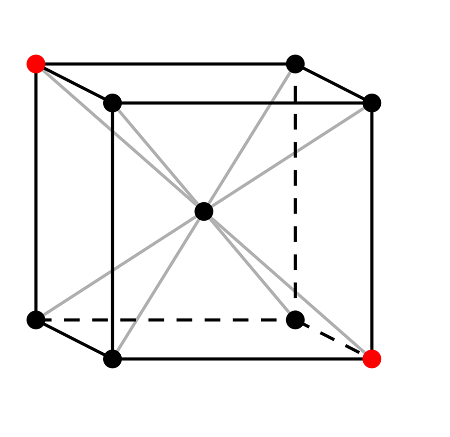
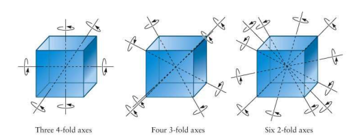
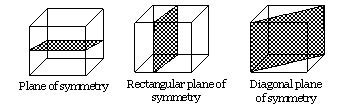

## Symmetry in Crystals

Symmetry plays a crucial role in the study of crystals, as it governs their structure and influences their physical, chemical, and optical properties. By understanding symmetry, we can gain insights into various crystal characteristics such as cleavage, conductivity, and diffraction patterns. In this experiment, we will focus on three primary types of symmetries commonly observed in crystal structures:
- Symmetry about a center
- Symmetry about an axis
- Symmetry about a plane

### Symmetry about a Center

A lattice exhibits **symmetry about a center** (also known as a center of inversion) when the lattice formed by the images of atoms, reflected through a central point, is identical to the original lattice. This means that for every point at a distance from the center in one direction, there exists an equivalent point at the same distance in the opposite direction.

#### Example:
Consider the body-centered cubic (BCC) structure. In the BCC lattice, the center of the cube acts as the center of symmetry because the image of any atom, reflected through this center, recreates the original lattice.

  

In the above image, the central point is the center of symmetry because the reflection of all lattice points through this center reproduces the lattice.

### Symmetry about an Axis

A lattice exhibits **symmetry about an axis** when rotating the lattice by a specified angle about that axis produces the original lattice. The angle required to restore the lattice is determined by the "fold" of the axis. For example:
- A **2-fold axis** requires a rotation of 180° (360°/2).
- A **3-fold axis** requires a rotation of 120° (360°/3).
- A **4-fold axis** requires a rotation of 90° (360°/4).
- A **6-fold axis** requires a rotation of 60° (360°/6).

  

#### Example:
Consider a square lattice. If we take the vertical axis passing through the center of a square and rotate the lattice by 90°, the lattice appears unchanged. This axis represents a **4-fold axis of symmetry**.

#### Example Problem:
- Identify the symmetry axis of a hexagonal close-packed (HCP) crystal.  
  **Solution:** The HCP crystal exhibits a 6-fold symmetry axis because a rotation of 60° about the c-axis restores the original lattice.

### Symmetry about a Plane

A lattice exhibits **symmetry about a plane** when reflecting the lattice through a specified plane results in a structure identical to the original lattice. This plane is called a **mirror plane** or **reflection plane**.

  

#### Example:
In a face-centered cubic (FCC) lattice, there are multiple planes of symmetry. For example, reflecting the lattice through a plane that cuts through the center of the unit cell produces an identical lattice.

#### Multiple Planes:
A crystal may have multiple planes of symmetry. For example:
- A cube (as in a simple cubic lattice) has **nine planes of symmetry**: three planes parallel to the faces and six diagonal planes.

#### Example Problem:
- How many planes of symmetry does a regular tetrahedron have?  
  **Solution:** A regular tetrahedron has six planes of symmetry, each passing through one edge and the opposite vertex.

---

### Applications of Symmetry in Crystals

1. **Crystallographic Notations:**
   Symmetry elements are used in the **Miller Index** notation to describe planes and directions in crystals.

2. **X-Ray Diffraction:**
   Symmetry influences the diffraction pattern, helping scientists determine crystal structures.

3. **Material Properties:**
   The symmetry of a crystal affects properties like **optical birefringence** and **electrical conductivity**. For example, cubic crystals like diamond have isotropic properties due to their high symmetry.
