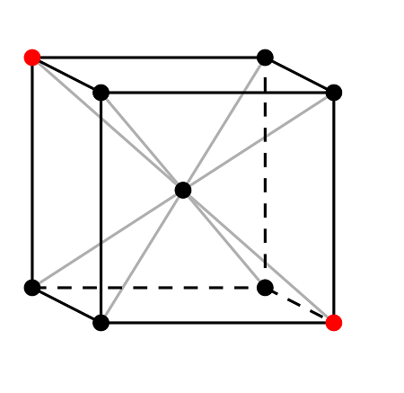
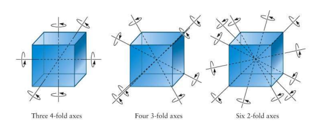
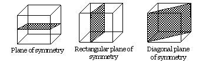

## Symmetry in crystals
Symmetry is something that can be observed greatly in crystal structures and in fact, learning more about crystal structure symmetries can help us in understanding some properties of crystals easily. An ideal crystal exhibits many kinds of symmetries but in this experiment we will be dealing primarily with three kinds of symmetries. They are
- Symmetry about a center
- Symmetry about an axis
- Symmetry about a plane

### Symmetry about a center
A lattice is said to have symmetry about a center when the lattice formed by the images of the atoms of the lattice with respect to the center of symmetry is the original lattice itself. An example can be seen below

  

In the above image, the centre point can be regarded as a center of symmetry because the image of all the atoms in the lattice about that point will re-create the original lattice.

### Symmetry about an axis
A lattice is said to have symmetry about an axis when the lattice obtained by rotating the given lattice about the specified axis of symmetry results in the original lattice. An example can be seen below

  

We notice that there are different categories of axes of symmetries. An axis of symmetry is called a "N-fold" axis of symmetry when the smallest angle that brings back the original lattice is 360/N degrees. For an example, a 2-fold axis of symmetry requires that the lattice be rotated atleast 180 degrees for the originality of the lattice to be restored.

### Symmetry about a plane
A lattice is said to have symmetry about a plane when the lattice obtained by reflecting the given lattice about the specified plane of symmetry results in the original lattice. An example can be seen below

  

We can see that a lattice can have multiple planes of symmtery. In fact, a lattice can have multiple centers and axes of symmetries along with planes of symmetries.
